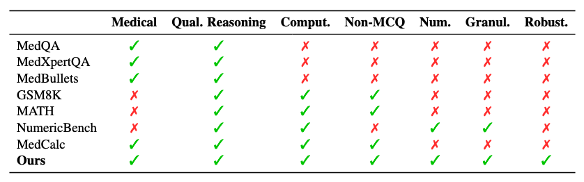
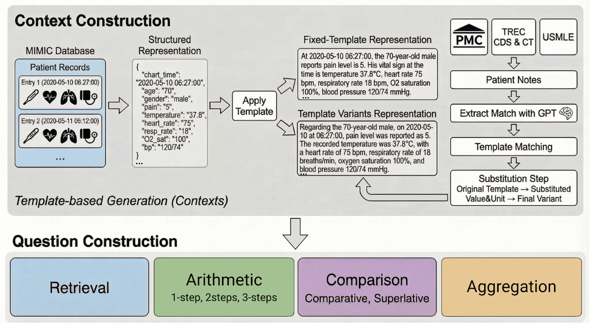
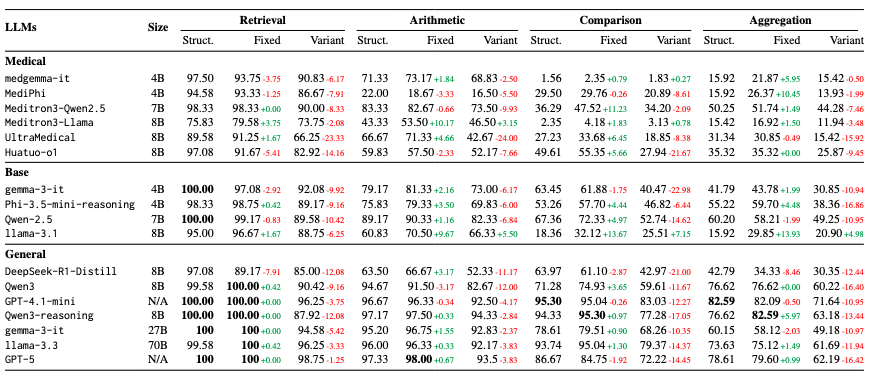

# ClinicNumRobBench
Official Implementation of ["How Robust Are Large Language Models for Clinical Numeracy? An Empirical Study on Numerical Reasoning Abilities in Clinical Contexts"](#).

DATASET: Pending URL on [PhysioNet](https://physionet.org/) due to editor reviewing



## Environment Setup

### Prerequisites

- Python 3.11 or higher
- Poetry for dependency management

### Installation

1. **Clone the repository:**
   ```bash
   git clone https://github.com/MinhVuong2000/ClinicNumRobBench.git
   cd ClinicNumRobBench
   ```

2. **Install Poetry (if not already installed):**
   ```bash
   curl -sSL https://install.python-poetry.org | python3 -
   ```

3. **Create virtual environment:**
   ```bash
   python3.11 -m venv .venv
   source .venv/bin/activate
   ```

4. **Install dependencies:**
   ```bash
   poetry install
   ```

## Build benchmark

You can get benchmark data from 2 sources:
1. Uploaded data on [PhysioNet](https://physionet.org/): pending URL, under review by Editor
2. Build your own data based on 2 steps below:


### 1. Format data and extract vitalsigns samples from MIMIC-IV & MIMIC-IV-ED dataset
```bash
papermill clinicnumrobbench/data_creation/preprocess_mimic4_samples.ipynb clinicnumrobbench/data_creation/preprocess_mimic4_samples.ipynb
```
After finishing, A file `data/mimiciv/mimic4ed/200_sampled.csv` will be created with 200 vitalsigns records from MIMIC-IV & MIMIC-IV-ED dataset from stratified sampling.

### 2. Build data
#### 2.1. Build structured and templated data
```bash
python clinicnumrobbench/data_creation/create_x_structure.py --context-mode structured 2>&1 | tee log/data/create_structured.log
python clinicnumrobbench/data_creation/create_x_structure.py --context-mode templated 2>&1 | tee log/data/create_templated.log
```
Return data has format for each row:
- question: context and question
- answer: answer in number/date
- data_source: sub-category derived

You also can run with notebook [`clinicnumrobbench/data_creation/create_x_structure.ipynb`](clinicnumrobbench/data_creation/create_x_structure.ipynb). 
- Set `context_mode` in the first cell: "structured" for structured data, "templated" for templated data
- Then run:
```bash
papermill clinicnumrobbench/data_creation/create_x_structure.ipynb clinicnumrobbench/data_creation/create_x_structure.ipynb
```

#### 2.2. Build realistic variant context data
1. Create an `.env` file in the root directory following the `.env.example` file
2. Extract template & realistic patient note & templates from Open Patients
```bash
python clinicnumrobbench/data_creation/extract_vital_sign_open_patients.py --model-name gpt-4.1-mini --batch-size 4 --output-path data/open_patients_extracted_vital_sign_raw.csv
```
An csv file at `output_path` with columns: `_id,description,extracted_vital_sign_text,extracted_vital_sign_json` will be created.
- _id: id from Open Patients data
- description: the patient note
- extracted_vital_sign_text: the extracted vital signs text. E.g: 
```text
"T: 39.5 C, BP: 90/60 HR: 120/min RR: 40/min"
```
- extracted_vital_sign_json: the extracted vital signs json. E.g: 
```text
"{'temperature': {'text': 'T: 39.5 C', 'number': '39.5', 'unit': 'C'}, 'heart_rate': {'text': 'HR: 120/min', 'number': '120', 'unit': 'min'}, 'respiratory_rate': {'text': 'RR: 40/min', 'number': '40', 'unit': 'min'}, 'oxygen_saturation': {'text': None, 'number': None, 'unit': None}, 'blood_pressure': {'text': 'BP: 90/60', 'number': '90/60', 'unit': None}}"
```

Run following command to create Realistic variant context data & ablation data for analysis
```bash
papermill clinicnumrobbench/data_creation/create_realistic_var.ipynb clinicnumrobbench/data_creation/create_realistic_var.ipynb
```
Then, new folders are created: `natural`, `ablation_var_retrieval`, `ablation_var_calc`, `ablation_var_comparison`, `ablation_var_sum`.

## Run LLM to get responses
replace `data_type` in `scripts/generate.sh` with proper format that need to run with:
- structured, templated, natural: main format representation
- ablation_var_sum, ablation_var_comparison, ablation_var_calc, ablation_var_retrieval: ablation study for impact of variant template factors
```bash
sh scripts/generate.sh
```

## Evaluate
```bash
sh scripts/eval.sh
```



## Analysis

### Fine-grained on sub-categories
please check file `clinicnumrobbench/analysis/fine_grain_comparison_summary.py`
```bash
python3 clinicnumrobbench/analysis/fine_grain_comparison_summary.py --prompt_type zero_shot_cot --data_dir outputs --task comparison
python3 clinicnumrobbench/analysis/fine_grain_comparison_summary.py --prompt_type zero_shot_cot --data_dir outputs --task summary
```

### Lexical Diversity
please check file `clinicnumrobbench/analysis/check_lexical_diversity.py` & `clinicnumrobbench/analysis/medcalc_comparison.ipynb`

## Citation
If you find this paper or the repo useful for your work, please consider citing the paper
